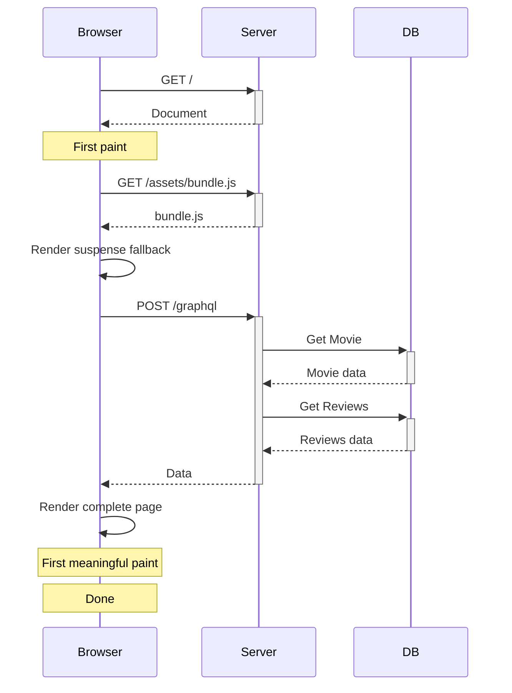
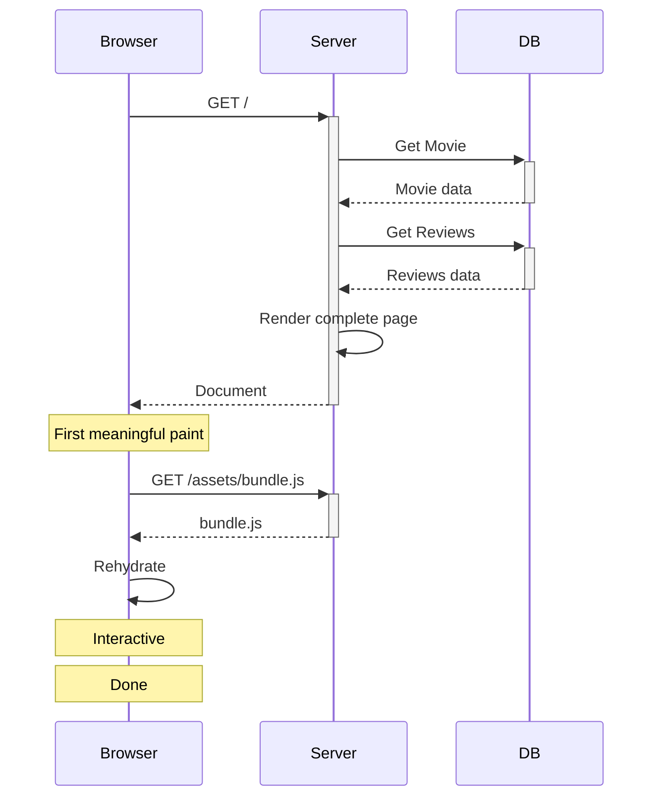
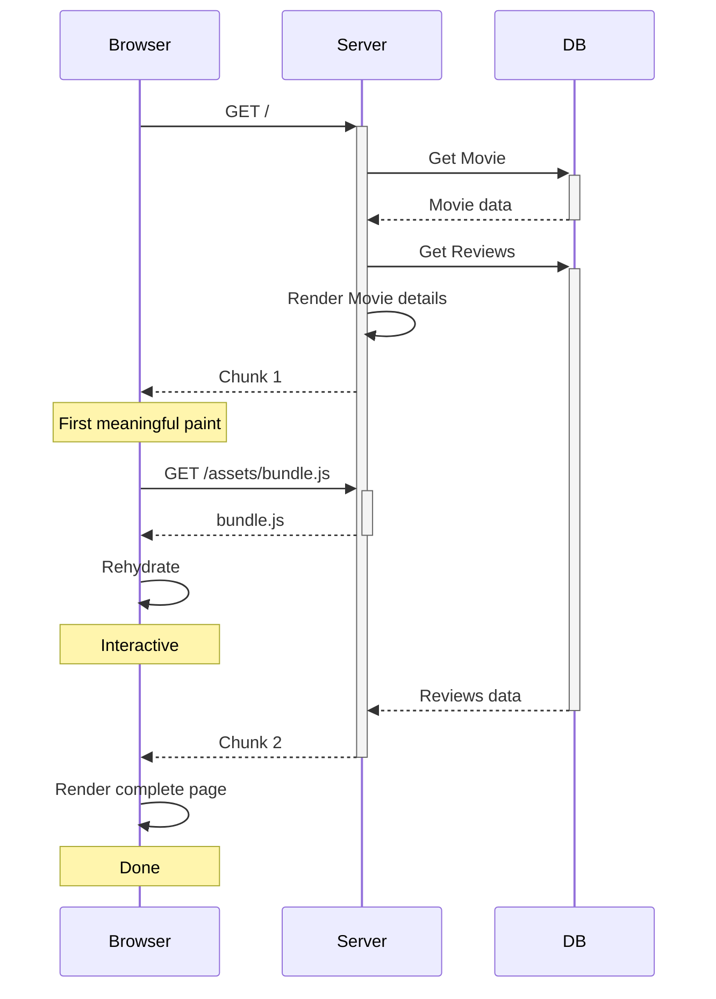

  <picture>
    <source media="(prefers-color-scheme: dark)" srcset="https://github.com/user-attachments/assets/adf6eedb-2c9e-4680-b058-dab4e6d1ea55">
    <source media="(prefers-color-scheme: light)" srcset="https://github.com/dantrain/remix-relay/assets/1765203/c2ab83b9-7e23-445d-b6cb-de4b3aff5d2e">
    
  </picture>

<h1 align="center">remix-relay</h1>

A small library providing integration between the [React Router v7](https://reactrouter.com/) framework (formerly [Remix](https://remix.run/)) and the [Relay](https://relay.dev/) GraphQL client.

## Docs

[Getting started guide](docs/getting-started.md)

## Examples

| [Movie app](https://dans-movie-app.pages.dev/) | [Counter app](https://dans-counter-app.fly.dev/) | [Trellix](https://trellix-relay.fly.dev/) |
| :---: | :---: | :---: |
|  |  |  |

## Sequence diagrams

### Relay SPA (no @defer)

### remix-relay (no @defer)

### remix-relay (with @defer)

