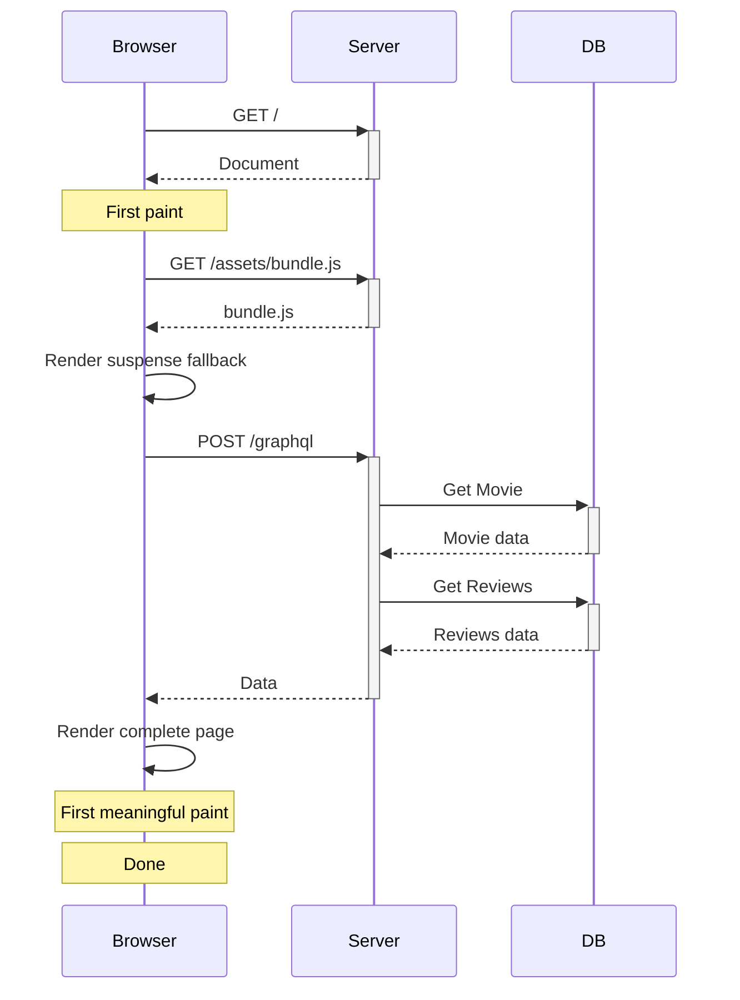
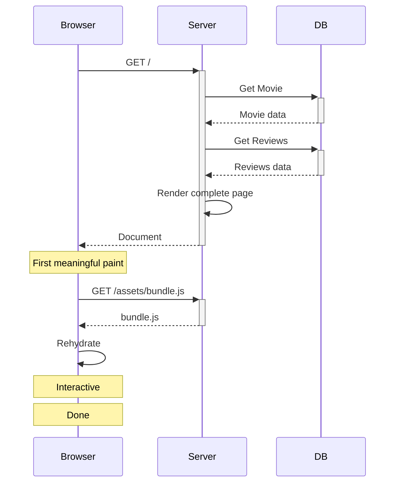
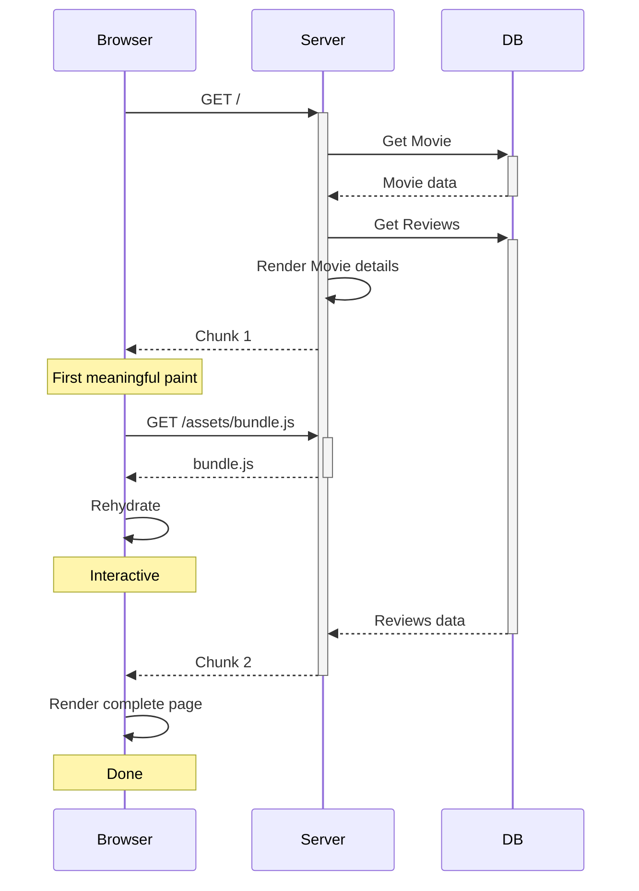

# Remix + Relay

### Relay SPA (no @defer)

### Remix + Relay (no @defer)

### Remix + Relay (with @defer)

## Installation

- `npm install @remix-relay/react @remix-relay/server react-relay relay-runtime graphql@17.0.0-alpha.2`
