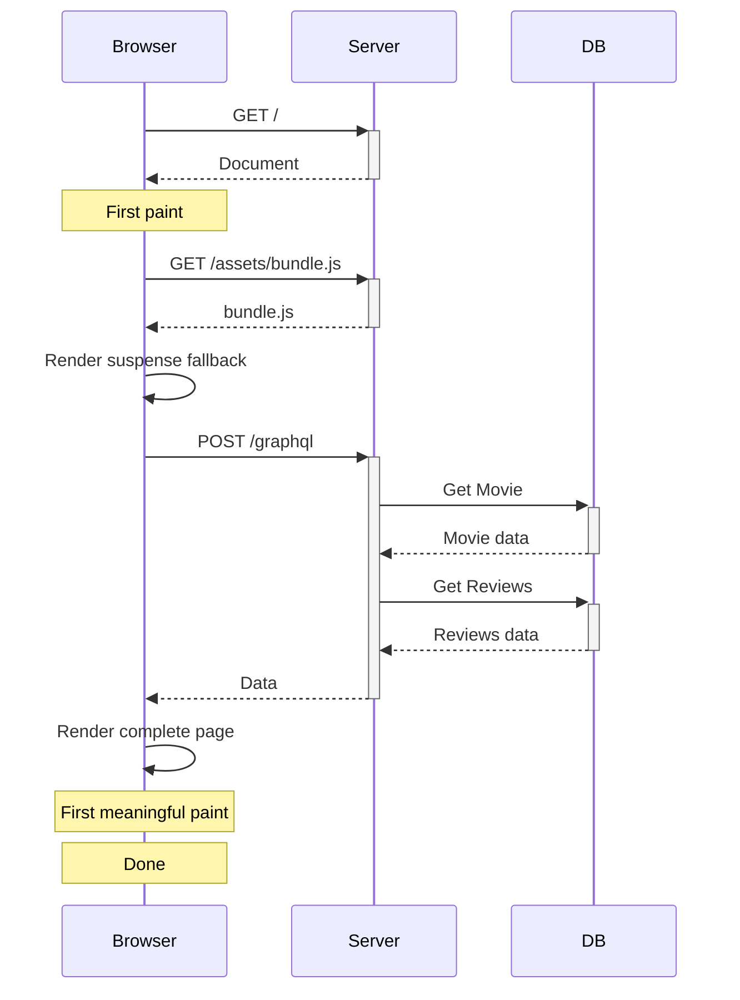
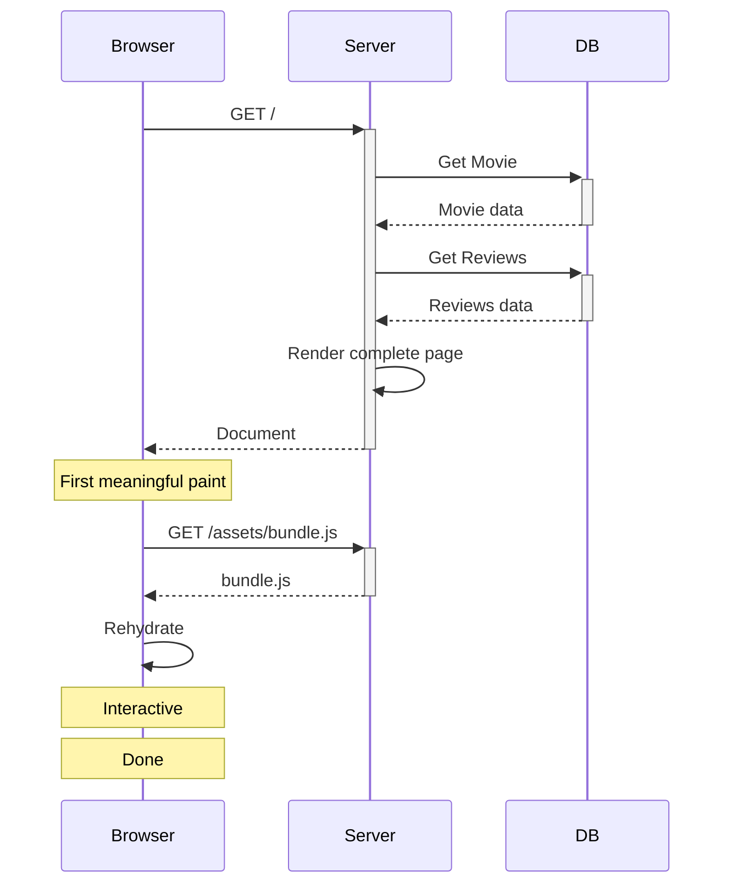
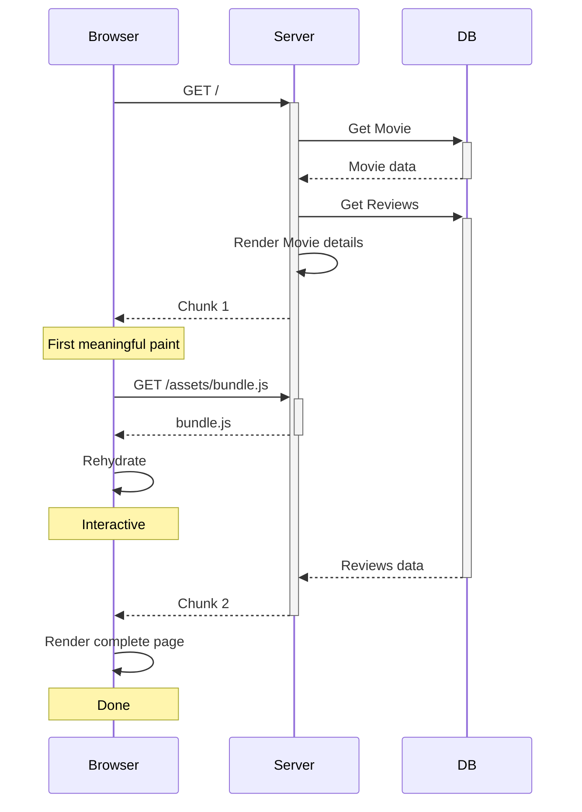

  

<h1 align="center">remix-relay</h1>

## Examples

- [Movie app](https://dans-movie-app.pages.dev/)
- [Counter app](https://dans-counter-app.fly.dev/)
- [Trellix](https://trellix-relay.fly.dev/)

## Installation

- `npm install @remix-relay/react @remix-relay/server react-relay relay-runtime graphql@17.0.0-alpha.2`

## Sequence diagrams

### Relay SPA (no @defer)

### remix-relay (no @defer)

### remix-relay (with @defer)

